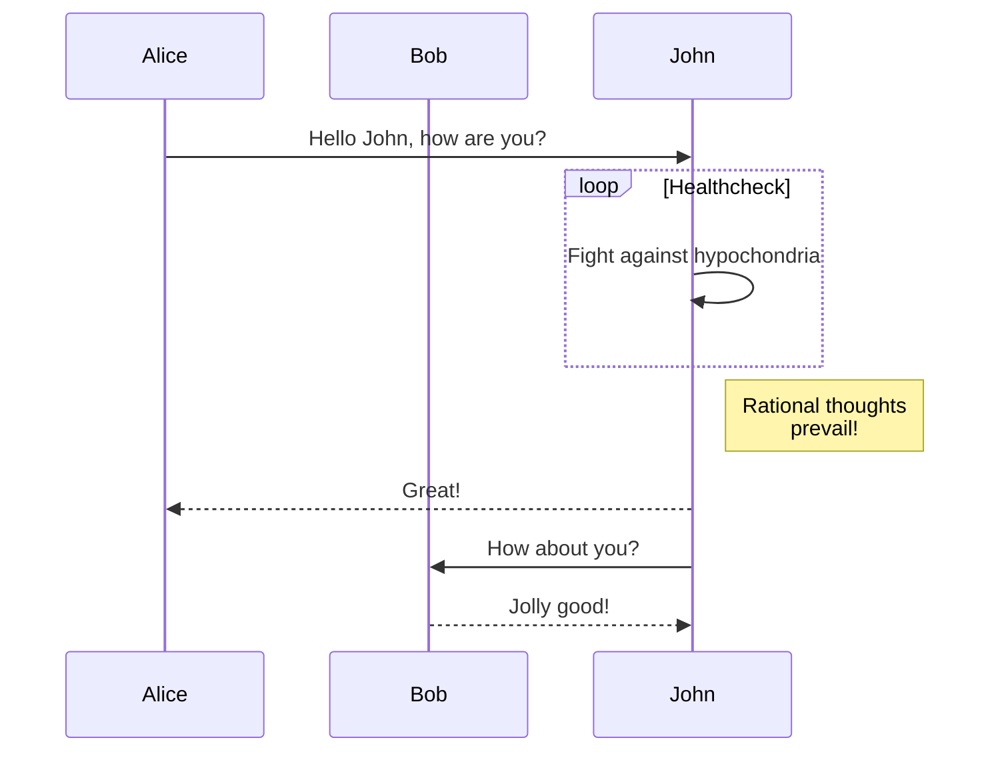
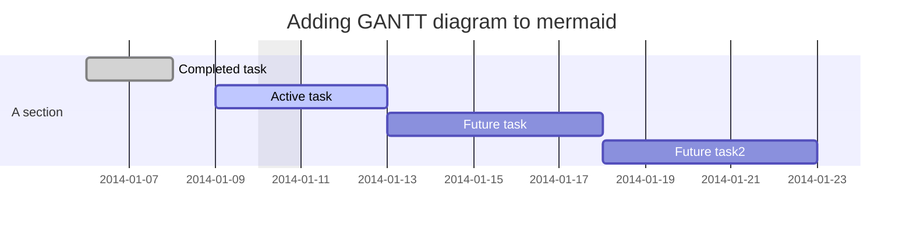
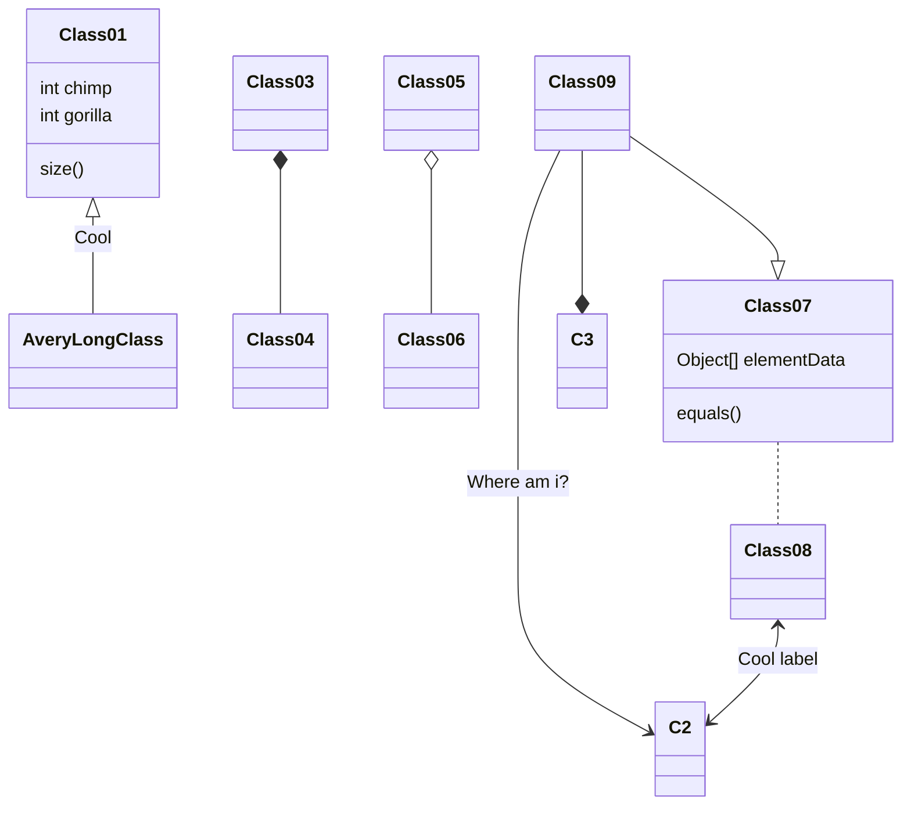
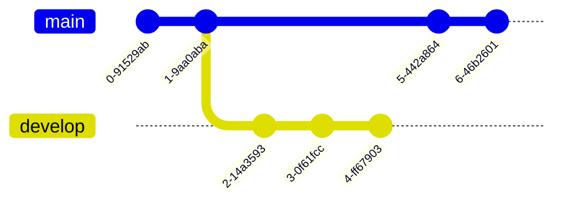
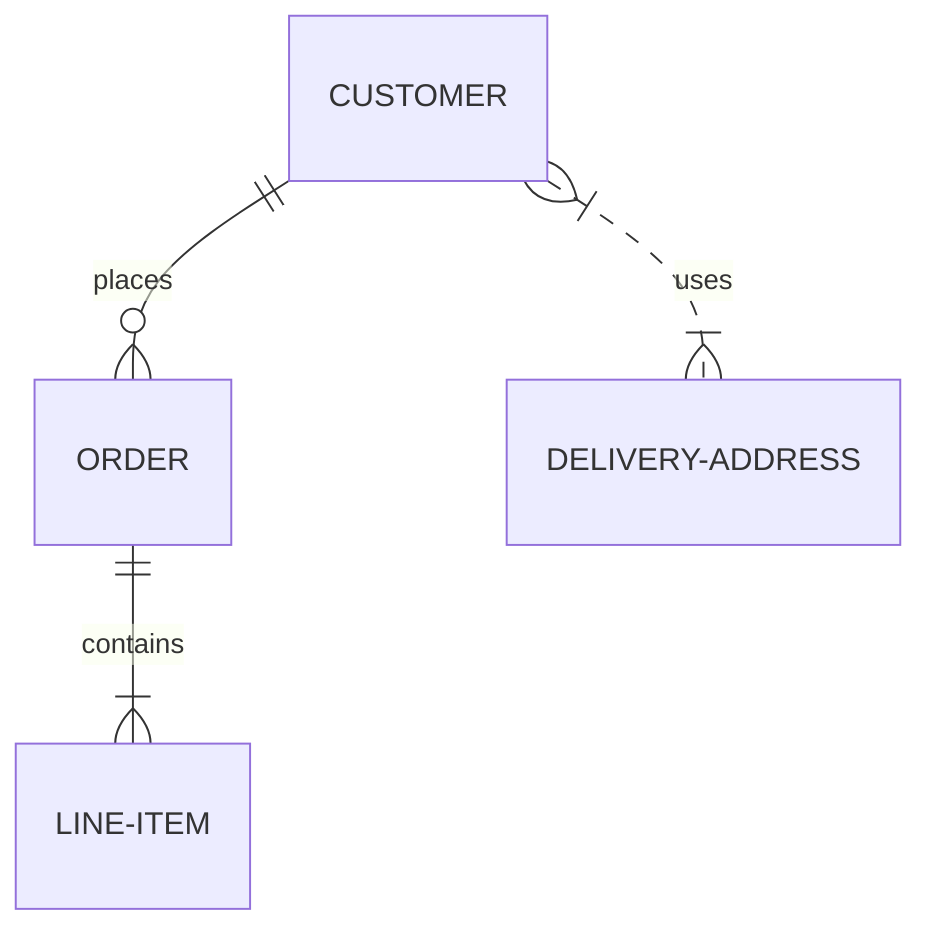
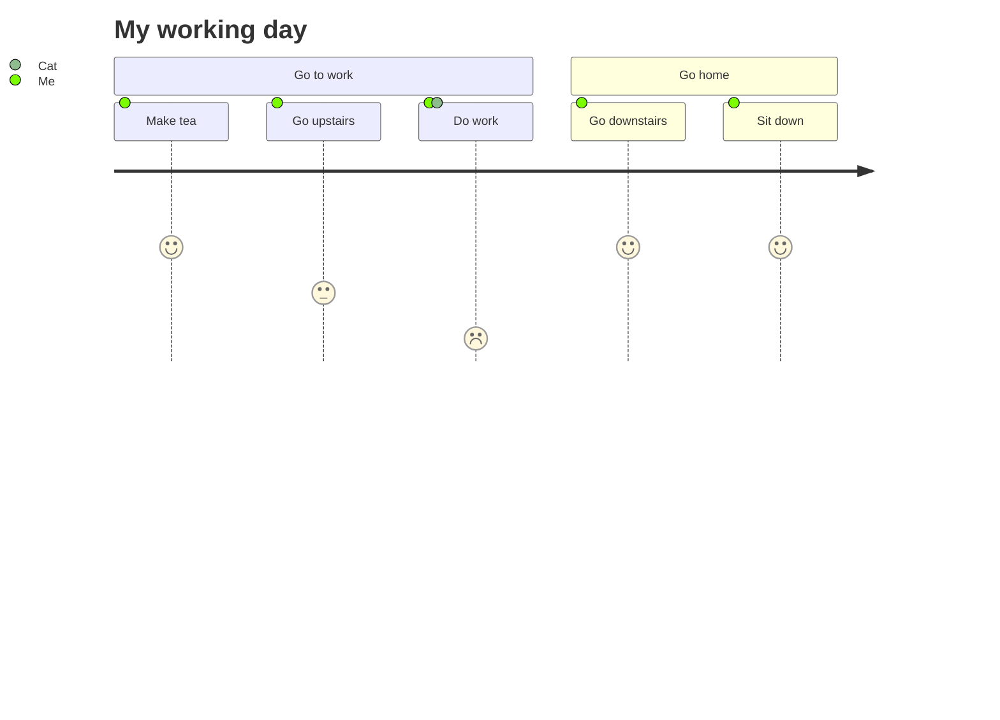
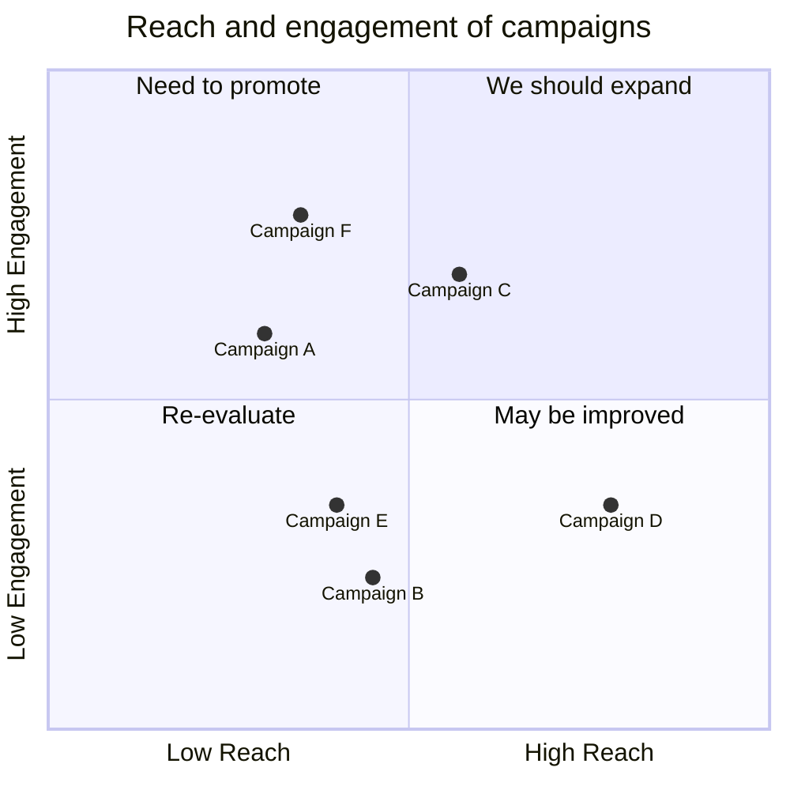
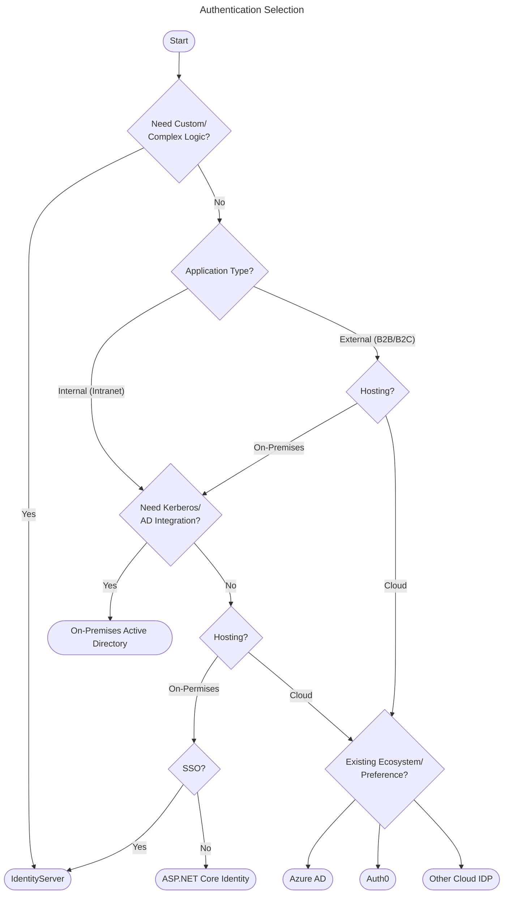

Markdown shown in the blurb.

```mermaid
graph TD;
    A-->B;
    A-->C;
    B-->D;
    C-->D;
```

<!--endintro-->

Markdown not shown in the blurb

```mermaid
graph TD;
    A-->B;
    A-->C;
    B-->D;
    C-->D;
```

```mermaid
sequenceDiagram
    participant Alice
    participant Bob
    Alice->>John: Hello John, how are you?
    loop Healthcheck
        John->>John: Fight against hypochondria
    end
    Note right of John: Rational thoughts <br/>prevail!
    John-->>Alice: Great!
    John->>Bob: How about you?
    Bob-->>John: Jolly good!
```

```mermaid
gantt
dateFormat  YYYY-MM-DD
title Adding GANTT diagram to mermaid
excludes weekdays 2014-01-10

section A section
Completed task            :done,    des1, 2014-01-06,2014-01-08
Active task               :active,  des2, 2014-01-09, 3d
Future task               :         des3, after des2, 5d
Future task2               :         des4, after des3, 5d
```

```mermaid
classDiagram
Class01 <|-- AveryLongClass : Cool
Class03 *-- Class04
Class05 o-- Class06
Class07 .. Class08
Class09 --> C2 : Where am i?
Class09 --* C3
Class09 --|> Class07
Class07 : equals()
Class07 : Object[] elementData
Class01 : size()
Class01 : int chimp
Class01 : int gorilla
Class08 <--> C2: Cool label
```

```mermaid
gitGraph
       commit
       commit
       branch develop
       commit
       commit
       commit
       checkout main
       commit
       commit
```

```mermaid
erDiagram
    CUSTOMER ||--o{ ORDER : places
    ORDER ||--|{ LINE-ITEM : contains
    CUSTOMER }|..|{ DELIVERY-ADDRESS : uses
```

```mermaid
journey
    title My working day
    section Go to work
      Make tea: 5: Me
      Go upstairs: 3: Me
      Do work: 1: Me, Cat
    section Go home
      Go downstairs: 5: Me
      Sit down: 5: Me
```

```mermaid
quadrantChart
    title Reach and engagement of campaigns
    x-axis Low Reach --> High Reach
    y-axis Low Engagement --> High Engagement
    quadrant-1 We should expand
    quadrant-2 Need to promote
    quadrant-3 Re-evaluate
    quadrant-4 May be improved
    Campaign A: [0.3, 0.6]
    Campaign B: [0.45, 0.23]
    Campaign C: [0.57, 0.69]
    Campaign D: [0.78, 0.34]
    Campaign E: [0.40, 0.34]
    Campaign F: [0.35, 0.78]
```

```mermaid
---
type: diagram
title: "Authentication Selection"
---
flowchart

 Start(["Start"]) --> CustomLogic{"Need Custom/\nComplex Logic?"}
 
 CustomLogic -->|"Yes"| IdentityServer(["IdentityServer"])
 CustomLogic -->|"No"| AppType{"Application Type?"}
 
 AppType -->|"Internal (Intranet)"| Kerberos{"Need Kerberos/\nAD Integration?"}
 AppType -->|"External (B2B/B2C)"| Hosting{"Hosting?"}
 
 KerberosHosting{"Hosting?"} -->|"On-Permises"| SingleApp{"SSO?"}
 KerberosHosting -->|"Cloud"| Ecosystem{"Existing Ecosystem/\nPreference?"}
 
 Kerberos -->|"No"| KerberosHosting
 Kerberos -->|"Yes"| OnPremAD(["On-Premises Active Directory"])
 
 Hosting -->|"On-Premises"| Kerberos
 Hosting -->|"Cloud"| Ecosystem

 Ecosystem --> Azure(["Azure AD"])
 Ecosystem --> Auth0(["Auth0"])
 Ecosystem --> OtherIDP(["Other Cloud IDP"]) 
 
 SingleApp -->|"Yes"| IdentityServer
 SingleApp -->|"No"| NETCORE(["ASP.NET Core Identity"])
```
